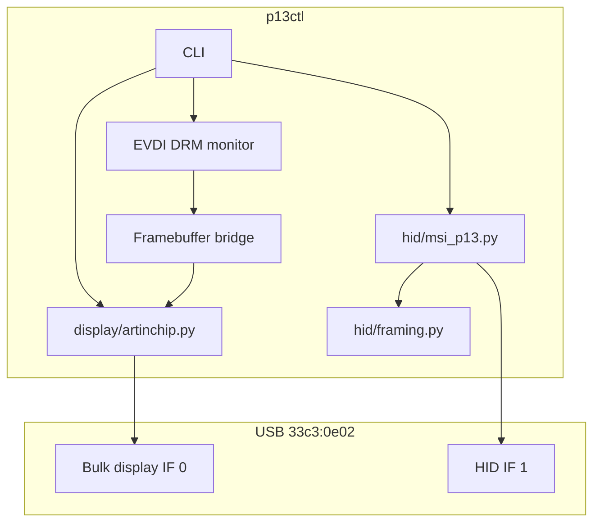

# Architecture

## Linux stack (this project)

On Linux, **p13ctl** uses EVDI to expose a standard 480×480 DRM monitor and bridges its framebuffer to the panel:

1. EVDI creates the desktop-visible virtual monitor.
2. The bridge reads its framebuffer and encodes it as JPEG.
3. The USB backend authenticates with the Artinchip firmware and streams frames.
4. HID commands control brightness, rotation, and host-display handoff.

Screen capture remains available as an explicit fallback with `p13ctl display desktop --capture`.

## Out of scope

- **Pump/fan curves**: PWM headers on the motherboard.
- **ARGB**: 3-pin 5V ARGB header or JAF_2 on MSI boards.
- **Mystic Light sync**: motherboard ecosystem, not the P13 USB device.
